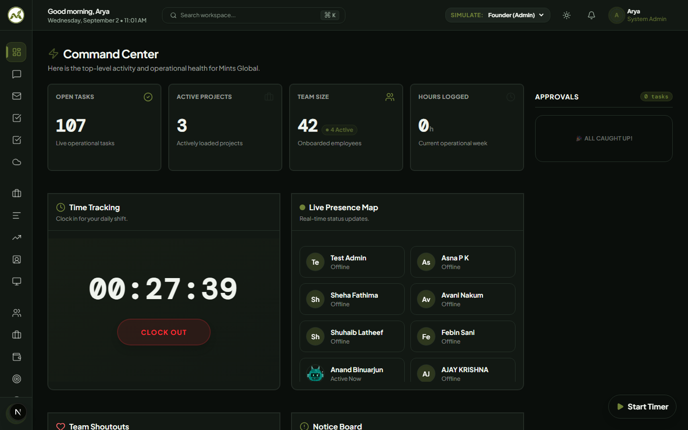

<p align="center">
  
</p>

<h3 align="center">
  One Command Center for HR, CRM, Projects, Finance &amp; Automated Workflows
</h3>

<p align="center">
  A proprietary enterprise operating system engineered with Next.js 16 (Turbopack), React 19, Tailwind CSS v4, and Google Cloud Firestore.
</p>

<p align="center">
  <a href="https://erp.mintsglobal.ae"></a>
  <a href="https://nextjs.org"></a>
  <a href="https://react.dev"></a>
  <a href="https://tailwindcss.com"></a>
  <a href="#compliance"></a>
</p>

---

## 🌟 Executive Overview

**Mints Global ERP** is an agile, multi-region enterprise operating system developed by **Mints Global** in Dubai, UAE. Built to replace fragmented, siloed SaaS stacks (which typically cost upwards of $185/user/month), Mints ERP delivers all 18 core business operations in a unified, real-time command center with sub-250ms telemetry.

<p align="center">
  
</p>

### Key Architectural Tenets
- **Single Source of Truth**: All 18 modules write to a unified Google Cloud Firestore schema—eliminating background sync lags, third-party webhook dropouts, and duplicate data entry.
- **Dual-Theme Design System**: Engineered with an Executive Ledger visual design, supporting instant switching between **Forest Dark** (`#0a0e0b`) and high-contrast **Sage Light** (`#f5f7f4`).
- **Hardware-Hardened Shift Telemetry**: Mathematical clock-skew clamping algorithm prevents client-side device timestamp spoofing on employee shift punches.
- **5-Tier Database Clearance (RBAC)**: Security rules enforced directly at the Firestore layer (Founders, C-Suite, Admin, Manager, Employee), preventing client-side privilege escalation.
- **Multi-Region Localization**: Native statutory billing across **UAE** (FTA 5% VAT), **United Kingdom** (HMRC Making Tax Digital), **India** (CGST, SGST, IGST with HSN/SAC codes), and the **European Union** (EN 16931 e-invoicing).

---

## 🧭 Platform Portals & Static Routes

The platform is statically prerendered with Next.js Turbopack across **22 public routes and documentation hubs**:

| Route Category | URL Path | Key Capabilities |
|---|---|---|
| **Global Editions** | `/`, `/uk`, `/india`, `/eu` | Localized statutory compliance, regional tax currencies (£, ₹, €, د.إ, $), and local comparison tables. |
| **Competitor Hub** | `/compare` | Chatwoot-style benchmark hub, 25-point capability matrix, and dynamic TCO ROI calculator ($12, $24, $49 seats). |
| **Competitor Profiles** | `/compare/vs-zoho`<br>`/compare/vs-sap`<br>`/compare/vs-tally`<br>`/compare/vs-sage`<br>`/compare/vs-monday` | Deep architectural comparisons with honest capability auditing and migration procedures. |
| **Help Center Hub** | `/help-center` | Interactive documentation portal with instant `Cmd/Ctrl + K` global search and 1-tap topic filter chips. |
| **Enterprise Manuals** | `/help-center/faq`<br>`/help-center/handbook`<br>`/help-center/product-doc`<br>`/help-center/user-manual` | 35+ verified Q&As (`FAQPage` schema), Employee Tenets, Cloud Serverless Specs, and 18-Module Operational Guide. |
| **Trust & Governance** | `/security`<br>`/accessibility`<br>`/terms`<br>`/privacy`<br>`/license` | ISO 27001 alignment, 99.95% Enterprise SLA, DPA procurement request, WCAG 2.1 AA statement, and RFC 9116 security file. |
| **Commercials & Logs** | `/pricing`<br>`/changelog` | Dedicated 5-currency pricing index with 20% annual discount, and continuous product delivery history (v1.2 to v1.6). |

---

## 🧩 The 18 Integrated Operations Modules

```
Mints Global ERP
├── People & Workforce
│   ├── HR Directory & Org Chart Tree
│   ├── Attendance State Machine (Clock-Skew Clamped)
│   ├── Dynamic Specialization Subroles
│   └── Multi-Level Leave Accrual Planner
├── Sales & Execution
│   ├── CRM Kanban Pipeline (Weighted Revenue Forecast)
│   ├── Interactive Gantt Timeline & Dependencies
│   ├── 7-Day Timesheet Matrix with Manager Approval
│   ├── Scoped External Client Portal
│   └── IT / HR Helpdesk Ticket Kanban
├── Finance & Treasury
│   ├── Multi-Region Invoicing (UAE VAT, UK MTD, GST, EU)
│   ├── Multi-Currency Treasury (USD, AED, GBP, INR, EUR)
│   ├── General Ledger & Financial Export Hub
│   └── Handover Document Cloud Vault
└── Communications & Automations
    ├── Visual Drag-and-Drop Workflow Builder
    ├── Corporate 3-Pane Internal Mail Room
    ├── Real-Time Corporate Chat Channels & DMs
    ├── Discord Webhook System Integration
    └── Tamper-Evident Administrative Audit Trail
```

---

## 🛠️ Tech Stack & Architecture

- **Core Framework**: [Next.js 16.3](https://nextjs.org/) (App Router, Turbopack Bundler)
- **UI Engine**: [React 19](https://react.dev/)
- **Styling**: [Tailwind CSS v4](https://tailwindcss.com/) with `@theme inline` design tokens in `src/app/globals.css`
- **Animations**: [Framer Motion](https://www.framer.com/motion/)
- **Database & Security**: Google Cloud Firestore & Firebase Admin SDK v14 (Serverless token validation)
- **Icons**: Lucide React + custom SVG vector assets
- **Typography**: `Plus_Jakarta_Sans` (Headings) & `Inter` (Body) via `next/font/google`
- **Compliance Standards**: WCAG 2.1 AA / EN 301 549, RFC 9116 (`security.txt`), Google Consent Mode v2

---

## 🚀 Getting Started

### Prerequisites
- Node.js 20.x or higher
- npm 10.x or higher

### Installation & Local Run

1. Clone the repository:
   ```bash
   git clone https://github.com/mintsweb2026-dotcom/ERP.git
   cd ERP
   ```

2. Install dependencies:
   ```bash
   npm install
   ```

3. Launch the development server:
   ```bash
   npm run dev
   ```
   Open `http://localhost:3000` in your web browser.

4. Validate static production build:
   ```bash
   npm run build
   ```
   *Compiles and prerenders all 22 static routes with 0 errors.*

---

## 🔒 Enterprise Security & Governance

- **Responsible Vulnerability Disclosure**: RFC 9116 disclosure file located at [public/.well-known/security.txt](public/.well-known/security.txt).
- **Standards Alignment**: Our Information Security Management System adheres to **ISO/IEC 27001:2022** and the **UAE NESA IAS** framework.
- **Data Sovereignty**: Regional Google Cloud data centers (Frankfurt, Belgium, London, Mumbai, Iowa) and Vercel edge networks.
- **Bilateral DPA**: Formal Data Processing Agreements available upon request via `info@mintsglobal.ae`.

---

## 🏢 Company Information

**Mints Global**  
*Office #315, 3rd Floor, Bank Street Building, Bur Dubai, Dubai, UAE*  
- **Official Website**: [https://mintsglobal.ae](https://mintsglobal.ae)  
- **Product Portal**: [https://erp.mintsglobal.ae](https://erp.mintsglobal.ae)  
- **Corporate Inquiries**: `info@mintsglobal.ae`  
- **Tagline**: *"SMARTER OPERATIONS. TOGETHER."*

---

<p align="center">
  <sub>© 2026 Mints Global. All rights reserved. Proprietary enterprise software.</sub>
</p>
